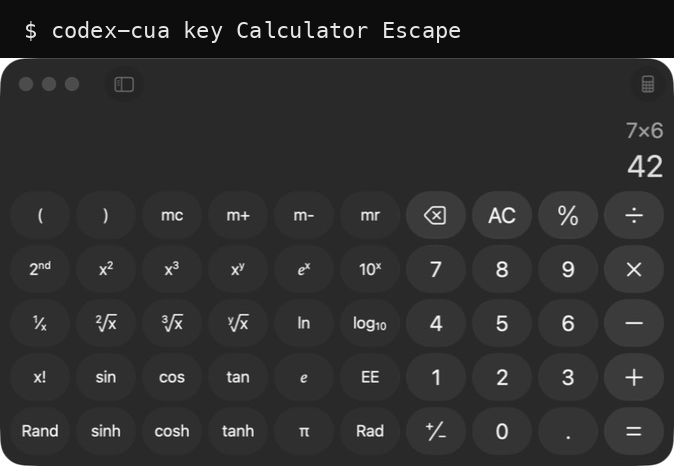

# codex-cua

Drive macOS apps from your shell with the Computer Use engine that ships inside Codex.



```bash
codex-cua apps                                  # what's running
codex-cua state Safari --out /tmp/safari.png    # accessibility tree + screenshot
codex-cua click Calculator -m 'Seven'           # click the button labelled Seven
codex-cua type Notes 'hello from bash'
codex-cua key Notes 'super+s'
```

No model in the loop, no agent, no API key. Every command is one accessibility action against one app, so you can put GUI steps in a shell script, a Makefile, or a test.

## Requirements

macOS, plus the [Codex](https://developers.openai.com/codex) or ChatGPT desktop app with Computer Use installed and permitted. Everything else is Python 3 stdlib.

## Install

```bash
git clone https://github.com/manaflow-ai/codex-cua
cd codex-cua && ./scripts/install.sh    # symlinks bin/codex-cua into ~/.local/bin
codex-cua doctor
```

`doctor` checks the whole chain: the codex binary, its code signature, the Computer Use bundle, the MCP client, and a live `list_apps` call.

## Why this needs the codex binary

Computer Use is already an MCP server on disk:

```
~/.codex/computer-use/Codex Computer Use.app/Contents/SharedSupport/
  SkyComputerUseClient.app/Contents/MacOS/SkyComputerUseClient mcp
```

Run it from a shell and every tool call comes back with:

```
Computer Use server error -10000: Sender process is not authenticated
```

`SkyComputerUseService` compares the sender's *parent* and *responsible* process team id against OpenAI's (`2DC432GLL2`). A shell is not that, so the handshake dies no matter how correct your JSON-RPC is.

The fix is to host the MCP server the way Codex hosts it. `codex-cua` starts `codex app-server`, points it at the Computer Use bundle with `-c` overrides, opens an ephemeral thread, and issues `mcpServer/tool/call`. The parent process is then OpenAI-signed and the service answers. Your `~/.codex/config.toml` is untouched.

## Commands

| Command | Underlying tool |
| --- | --- |
| `apps` | `list_apps` |
| `state <app>` | `get_app_state`, tree to stdout, screenshot to `--out` |
| `screenshot <app> --out F` | `get_app_state`, image only |
| `find <app> <regex>` | `get_app_state` filtered to `index<TAB>line` |
| `click <app> [-e IDX \| -m REGEX \| --x X --y Y]` | `click` |
| `type <app> <text>` | `type_text` |
| `key <app> <key>` | `press_key`, xdotool syntax (`Return`, `super+c`, `KP_0`) |
| `scroll <app> -m REGEX -d up\|down\|left\|right` | `scroll` |
| `drag <app> --from X,Y --to X,Y` | `drag` |
| `set-value <app> <value> -m REGEX` | `set_value` |
| `select-text <app> <text> -m REGEX` | `select_text` |
| `action <app> <action> -m REGEX` | `perform_secondary_action` |
| `call <tool> '<json>'` | any tool, raw |

`--json` prints the raw MCP result, `--quiet` drops the tree, `--out` saves screenshots.

## Element indices are per snapshot

`state` numbers each element, and those numbers only mean something inside the tree they came from. macOS Calculator renumbers its digit buttons depending on whether the window is frontmost, so a `find` in one command and a `click -e` in the next can land on the wrong button.

`-m REGEX` avoids that by taking a fresh tree and resolving the index inside the same call. An ambiguous regex fails and prints the first ten candidates instead of guessing:

```
$ codex-cua click Calculator -m button
55 elements match 'button'; refine it or pass --first:
  5	5 button Description: Open Parenthesis, ID: OpenParenthesis
  6	6 button Description: Close Parenthesis, ID: CloseParenthesis
  ...
```

Expect two spellings in the tree. An unfocused window renders `23 button Nine`, a focused one renders `23 button Description: 9, ID: Nine`. Matching `Nine` covers both, `button Nine` covers one.

## Session daemon

The first command starts a background `codex app-server` holding one thread. Startup is around 20 seconds, after which commands run in well under a second, and the app-use session Computer Use requires before any interaction stays warm. Interactions auto-prime with `get_app_state` the first time they touch an app.

```bash
codex-cua daemon status
codex-cua daemon restart
codex-cua daemon stop      # logs in ~/.cache/codex-cua/session.log
```

The daemon endpoint is a random Unix socket inside a mode `0700` session directory. A mode `0600` token file and a mutual per-connection challenge response authenticate the daemon and every request, including `status` and `stop`. macOS peer credentials and the audit token are checked before the request is read. The endpoint, PID, log, and lock files are opened without following symlinks and are kept mode `0600`. Requests are capped at 1 MiB and replies at 16 MiB, which leaves room for a base64 screenshot without allowing unbounded memory use.

Clean shutdown removes the session directory before acknowledging `stop` or `restart`, so a restart cannot race the startup lock. If the daemon is killed, the next start reclaims only unreferenced `.s-<random>` directories older than 24 hours, with private ownership, expected file types, and no live socket. Unknown entries and ambiguous paths are left untouched.

The normal Python CLI is unsigned, so the default policy requires the current user and the kernel audit-token/PID match. Managed installations can require a code-signing team with `CODEX_CUA_ALLOWED_TEAM_IDS=TEAMID[,TEAMID...]`; `CODEX_CUA_REQUIRE_TEAM_ID=1` also rejects unsigned clients. Team checks use Security.framework when macOS provides it and fail closed when strict mode is enabled.

Versions before `0.2.0` used `session.sock` without authentication. This version never connects to that legacy socket. Stop an old process with the old binary, then remove its stale socket after checking the path; a new command starts an isolated v2 session automatically.

`--no-daemon` runs a throwaway app-server instead, about 5 seconds per command and no residue.

## Scripting example

Compute 7 × 6 and assert the result:

```bash
codex-cua key Calculator Escape -q
for k in Seven Multiply 'Six' Equals; do
  codex-cua click Calculator -m "$k" -q
done
codex-cua find Calculator '^[0-9]+ text'    # 6	6 text 42
```

## Tests

```bash
python3 -m unittest discover -s tests
```

Tree and coordinate parsing are covered. Everything else needs a live app, so verify by driving one and reading back the value that should have changed.

## Limits

macOS only. Computer Use has to be installed and permitted through the Codex or ChatGPT desktop app, and this repo ships none of it. The tools, the service, and its authentication rules belong to OpenAI and can change without notice. Not affiliated with or endorsed by OpenAI.

The token and Unix-socket permissions protect against other users and accidental local callers. A process that already has the same user account's full local access can read the token or impersonate an unsigned CLI, so use `CODEX_CUA_ALLOWED_TEAM_IDS` and `CODEX_CUA_REQUIRE_TEAM_ID` for a stronger managed boundary. Security.framework resolves a peer's team by PID after the kernel supplied audit-token check; a PID can be reused after a peer exits, so team identity is an additional policy check, not a replacement for the challenge or peer credentials.

## License

MIT
